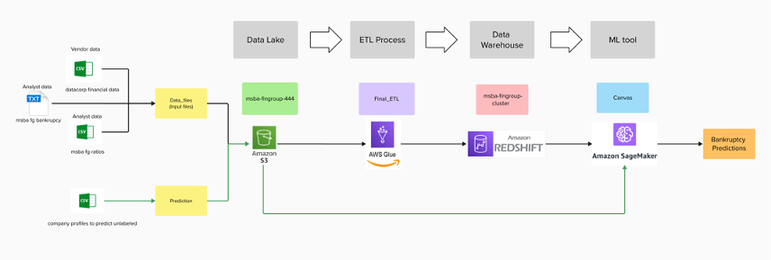
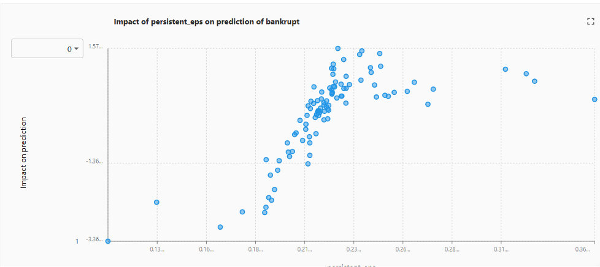

# 🏦 Bankruptcy Risk Prediction | MSBA Financial Group

Hi, I’m Aupala Bhattacharyya! This project is a cloud-native data pipeline I developed as part of **GENBUS 780: Cloud Technology for Business Analytics** at the Wisconsin School of Business. It uses AWS-native tools—no Python or SQL—to predict bankruptcy risks and help MSBA Financial Group make informed investment decisions.

---

## 📌 Project Overview

As an analyst for **MSBA Financial Group**, I was tasked with building a prototype cloud-native data architecture in AWS. MSBA receives financial data from three different internal sources:

- **Vendor Data** from DataCorp: [datacorp_financial_data.csv](./datacorp_financial_data.csv)
- **Analyst A Ratios**: [msba_fg_ratio_data.csv](./msba_fg_ratio_data.csv)
- **Analyst B Bankruptcy Records**: [msba_fg_bankruptcy.txt](./msba_fg_bankruptcy.txt)

The new CIO requested a centralized and scalable system that would:

- Ingest raw financial data from various sources and formats
- Consolidate it into a centralized data warehouse
- Enable easy future automation and scalability
- Perform exploratory data analysis (EDA)
- Train and apply a machine learning model to predict bankruptcy risk
- Score 10 new companies being considered for a portfolio

This system was developed entirely within **AWS Console tools**: S3, Glue, Redshift, and SageMaker Canvas.

---

## 🧰 Tools & Services Used

| AWS Service              | Role                                                         |
|--------------------------|--------------------------------------------------------------|
| **Amazon S3**            | Stores raw data and model outputs                            |
| **AWS Glue Studio**      | Visual ETL to join, clean, and transform financial datasets  |
| **Amazon Redshift**      | Data warehouse for consolidated analytics-ready tables       |
| **Amazon SageMaker Canvas** | No-code tool for EDA and training a classification model  |

---

## 🗺 Architecture Diagram

### Step-by-Step Data Flow:
1. Data from three sources is uploaded to **Amazon S3**
2. **AWS Glue** joins and transforms the data into clean datasets
3. Transformed data is loaded into **Redshift** for storage and analysis
4. **SageMaker Canvas** connects to Redshift to:
   - Perform EDA
   - Train a machine learning model
   - Predict bankruptcy risk
5. Output files are saved back to S3 for reporting and decision-making

---

## 📁 Data Files

- `datacorp_financial_data.csv`: Balance sheet and income statement data
- `msba_fg_ratios_data.csv`: Analyst-calculated financial ratios
- `msba_fg_bankruptcy.txt`: Company bankruptcy outcomes
- `company_profiles_to_predict_unlabeled.csv`: 10 target companies for scoring
- `MSBA_Financial_Group_Data_Dictionary.pdf`: Definitions for all fields

---

## 📊 Model Insights & Predictions

I used SageMaker Canvas to perform auto-EDA and train a model that classifies bankruptcy risk. The model learned from historical financial and bankruptcy data.

### 📌 Key EDA Insights

- Companies with **sustained positive EPS** and **higher net income-to-assets** ratios showed lower risk.
- **Volatile earnings** or frequent losses were highly predictive of bankruptcy.

### ✅ Model-Based Recommendations

**Recommended for Inclusion:**
- Pharmasolve  
- Ninetech  
- Songster Inc  
- Rogers & Sons  
- Hallandall AG  
- Foster & Kruse  
- Highwood & Hart  

**Not Recommended:**
- Western Corp  
- Design Solutions  
- Innocore  

Prediction files were exported as `.csv` and `.png` to Amazon S3.

[Presentation](./CT_Aupala%20(1).pdf)
Narration:[Link](https://www.loom.com/share/9b369b60dbf9468585e0f5e2f1a45606?sid=43bdb728-c6b8-4fd3-a4a8-1f03f2d75381)
---

## 🛠 Runbook (No Code)

To replicate the workflow:
1. Upload data files to the S3 bucket `msba-fingroup-444`
2. Run ETL in AWS Glue via visual job `Final_ETL`
3. Query and explore in Redshift cluster `msba-fingroup-cluster`
4. Use SageMaker Canvas to train & evaluate model, then export predictions

---

## 🔭 Future Enhancements

- Automate Glue ETL via triggers or AWS EventBridge
- Use Amazon QuickSight for real-time visualization dashboards
- Deploy SageMaker Pipelines for ongoing model updates
- Build a stakeholder-friendly reporting layer

---
